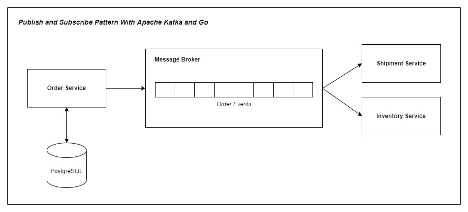

# Pub/Sub Pattern dengan Apache Kafka dan Go

## Deskripsi
Penerapan sederhana pola publisher dan subscriber menggunakan platform message broker Apache Kafka dan bahasa pemrograman Go.

## Ketergantungan Sistem
Layanan ini menggunakan database dan message broker:
1. Database PostgreSQL
2. Message Broker Apache Kafka

Untuk memenuhi kebutuhan tersebut sudah disiapkan sistem container yang siap dijalankan dengan cara:

Pertama kali membuat container dan menjalankannya:
```bash
docker compose up -d
```

Untuk berikutnya dapat menggunakan:
```bash
# Mematikan container
docker-compose stop

# Mengaktifkan container
docker-compose start

# Mematikan container dan menghapus container
docker compose down
```

## Desian Sistem


Aplikasi pada repository ini dibagi menjadi 3 bagian:
1. Layanan order service (REST API)
2. Consumer shipment (console app) untuk simulasi penerimaan event
3. Consumer inventory (console app) untuk simulasi penerimaan event

## Menjalankan Layanan
Cara menjalankan layanan bagi pengguna Mac / Linux / WSL yang memiliki ```SHELL``` pada path ```/bin/bash``` dapat menggunakan make system.
Atau dapat pula dijalankan dengan langsung memanggil file utama pada masing - masing aplikasi.

Menjalankan layanan ```HTTP Order service``` :
```bash
# Makefile
make run/service
```
```bash
# Normal run service
go run .
```

Menjalankan layanan ```Consumer Shipment Service```
```bash
# Makefile
make run/consumer-shipment
```
```bash
# Normal run service
go run app/consumer_shipment/main.go
```

Menjalankan layanan ```Consumer Inventory Service```
```bash
# Makefile
make run/consumer-inventory
```
```bash
# Normal run service
go run app/consumer_inventory/main.go
```

## Sumber Referensi
* [Confluent - Getting Started with Apache Kafak and Go](https://developer.confluent.io/get-started/go/#introduction)
